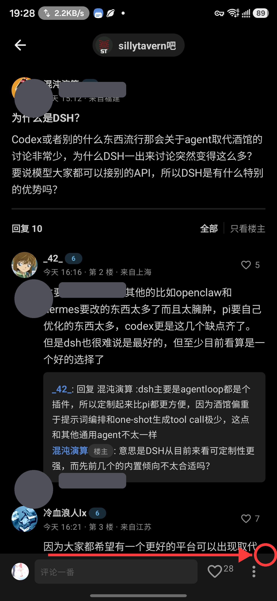
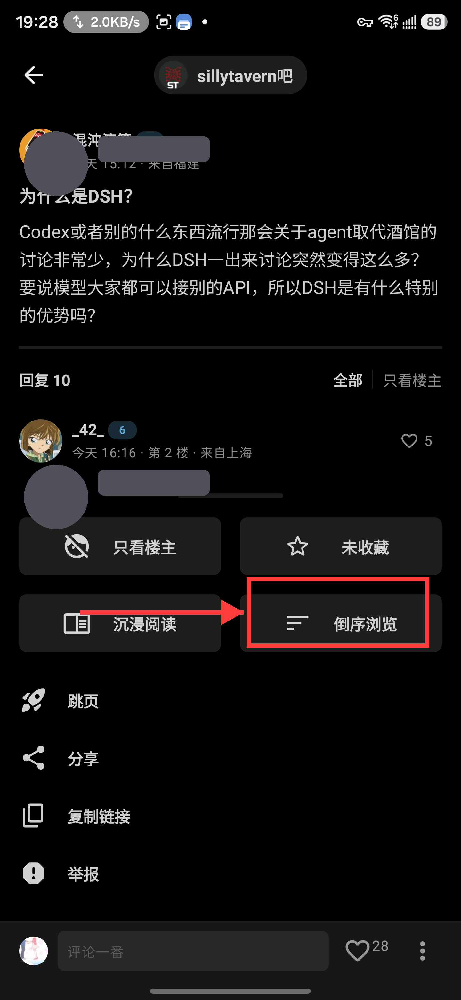

# <p align="center">贴吧 Lite · TiebaLite</p>
<p align="center"><strong>第三方百度贴吧 Android 客户端 | 全量一键签到 · 3000+ 吧全覆盖 | 智检更新 · 草稿回溯 | Android 5.0 → 16 全世代兼容 | Compose · Kotlin · 无广告</strong></p>
<p align="center">
    <a href="https://github.com/min09577/TiebaLite/releases/latest">
        
    </a>
    <a href="https://github.com/min09577/TiebaLite/actions/workflows/build.yml">
        
    </a>
    <a href="https://github.com/min09577/TiebaLite/blob/4.0-dev/LICENSE">
        
    </a>
    
    
</p>

> ### 👤 维护者近况 / Maintainer's Corner
> 当你发现本仓库没有更新版本或修复 Bug 时，维护者大概率正在 **旅行、跑外卖、打游戏、写小说**，
> 或是在 **美 / 韩 / 日 股市与外汇市场** 间辗转腾挪，亦或是在领取失业金——生活的剧本从不单一。
>
> 但请放心：**每一枚被提交的 Bug，都会被逐一排查、逐一修复。**
>
> - 📱 **测试设备**：三星 Galaxy S 系列旗舰 + Z Fold 系列（港版系统）
> - 🚀 **规划中**：后续有望纳入 OPPO / vivo / 小米 真机覆盖
> - 🐉 **鸿蒙现状**：暂未持有鸿蒙真机，鸿蒙端 Bug 短期内较难定位修复；如有鸿蒙设备的朋友，欢迎自行下载源码尝试修复

---

## ✨ 为什么选择贴吧 Lite / Why TiebaLite

| 特性 | 说明 |
|------|------|
| 📝 **全量一键签到** | 智能分页拉取所有关注贴吧，单次签到覆盖 3000+ 吧，通知栏实时进度 |
| ⏰ **定时自动签到** | Doze 休眠精准唤醒，零后台驻留，到点自动完成全量签到 |
| 📝 **草稿箱回溯** | 回复自动保存，草稿列表带吧名/内容预览，点击直达原帖楼层 |
| 🔄 **倒序浏览 · 只看楼主** | 排序链路兜底贯通，收藏页 / 搜索页进入均稳定生效 |
| 🎯 **通知直达原帖** | 「回复我的」一键跳转原帖对应楼层，上下文一目了然 |
| 🎬 **视频播放畅通** | 贴吧视频 http→https 自动升级 + bdstatic 白名单，黑盒彻底打通 |
| 🛡️ **导航零闪退** | 全项目路由陷阱收网，长按复制 / 吧规 / 吧内搜索稳如磐石 |
| 🔍 **智能检查更新** | 内置 GitHub Release 探测，一键比对云端版本，直链下载 release APK |
| 🖼️ **图片批量下载** | PhotoView 多选模式，跨页勾选，一键保存全部选中图片 |
| 📋 **应用日志窗** | 关于页一键进入，实时记录关键操作，支持复制分享辅助排障 |
| 🚫 **零广告** | 无横幅、无推广、无信息流广告，纯粹浏览体验 |
| 🎨 **Material Design** | Jetpack Compose 构建，原生 Material You 动态主题 |
| ⚡ **轻量流畅** | APK 仅 ~10MB，自适应高刷，无冗余功能 |
| 🔒 **隐私优先** | 无埋点跟踪，仅与百度贴吧 API 通信 |
| 📱 **超长世代兼容** | 横跨 Android 5.0 (API 21) 至 Android 16 (API 36)，11 年系统全面覆盖，16KB 页对齐 |
| 👥 **多账号切换** | 点击头像一键切换账号，支持多账号管理 |
| 📐 **内容密度调节** | 紧凑/标准/舒适三种间距模式 |
| 💾 **离线缓存** | 网络断开时自动加载缓存的帖子列表 |
| 🤖 **某不知名 AI 维护** | 原作者归档后由某不知名 AI 接管维护，依赖链保持最新 |
| 🏗️ **现代技术栈** | Kotlin 2.0.21 + Compose BOM 2024.12 + Hilt + Protobuf |
| 📦 **一键安装** | [Release 页面](https://github.com/min09577/TiebaLite/releases/latest) 直接下载 APK |

---

## 📖 简介

贴吧 Lite 是一个**非官方**的百度贴吧 Android 客户端，使用 Kotlin 编写，UI 采用 Jetpack Compose 构建。支持从 **Android 5.0 到 Android 16** 超长世代覆盖，完美适配 16KB 页面对齐。本质是对百度贴吧 API 的逆向工程实现，目标是在不牺牲核心浏览体验的前提下，提供最轻量、最干净的贴吧客户端。

> **⚠️ 声明：** 本软件及源码仅供学习交流使用，严禁用于商业用途。与百度公司无关。

## 🆕 v4.0.0-ai.38 — 启动稳定性重构 + 收藏偏好贯通

> ### 🚀 冷启动闪退根治（社区贡献合入 · 致谢 @wufeng5702）
> 红米 K50 / Note 11T Pro / Nothing Phone 2 等机型「点开即闪退」的顽疾尘埃落定：
> 根因为 `LocalNavigator` 未在顶层组合作用域提供，导航上下文在部分启动路径下悬空。
> 现于 `MainActivityV2` 顶层 `CompositionLocalProvider` 全局注入，
> `NotificationsPage` 显式传参、`HotPage` 消除参数遮蔽，二十余处读取点全部兜底（#6 / #9 / #17）。
>
> ### 🧬 Java 21 API 前向兼容
> `removeFirst()` / `removeLast()` 统一替换为 `removeAt()` 等价写法，
> 规避高版本 JDK 编译产物在旧版 Android 运行时触发 `NoSuchMethodError` 的隐患。
>
> ### 🎛️ 收藏页浏览偏好全链路生效
> 「从收藏进入默认只看楼主 / 默认倒序浏览」两个开关此前仅有定义、未参与初始化。
> 现打通 `from=FROM_STORE` 路由传递链（Routes → MainActivity → 收藏页跳转），
> 进帖即应用偏好；刷新 / 重试 / 续读全程携带收藏上下文不回退，手动切换依旧即时生效（#3）。

## 🆕 v4.0.0-ai.37 — 回帖直达自己主页

> ### 🎯 个人中心回帖入口精准归位
> 个人中心「回帖」统计数字此前误用本地数据库主键 `account.id` 当作贴吧 UID，
> 导致误入他人主页。现已改用真实贴吧 UID `account.uid`。
>
> ### 📑 Tab 精准定位
> 「回帖」点击现在直达用户详情页的「回复」Tab（`user/{uid}?tab=1`），
> 三级 Composable 函数（Page → Content → Normal/Expanded）参数链贯通，无需手动切换。

## 🆕 v4.0.0-ai.35 — 回帖点击回归

> ### 🎯 个人中心回帖入口启用
> 个人中心的「回帖」统计数字之前无任何响应，现已接入跳转逻辑：
> 点击 → 直接进入二级菜单用户详情页，复用既有回复 Tab。
>
> ### 🔗 二级菜单回帖点击统一跳转
> 点击二级菜单「回复」列表中的内容（红色框区域）原会因路由字面量陷阱闪退：
> - `subposts/0`（硬编码 threadId=0） → SubPostsPage 加载失败
> - `thread/threadId`（字面量而非变量） → 路由解析崩溃
>
> **修复策略：统一改为 `thread/{threadId}?postId={postId}&scrollToReply=true`**
> 点击回复内容 = 点击主题贴效果，都直达原帖对应楼层。

## 🆕 v4.0.0-ai.34 — 定时签到时钟校准

> ### ⏰ 跨天顺延机制
> 此前定时签到偶发漏签，根因在 `initAutoSign` 时间判断逻辑：
> - 今日目标时刻已过 → 直接不设闹钟（漏签）
> - 闹钟触发后 reschedule 因毫秒级误差判断为「已过」 → 次日不再预约
>
> **修复策略：**
> - 秒 / 毫秒清零，消除判断误差
> - 目标时刻已过则顺延至次日，闹钟始终有效
> - 覆盖三处调用：App 启动 / 闹钟 reschedule / 开机重启
>
> 从此签到到点准时触发，全天候稳定运转。

## 🆕 v4.0.0-ai.33 — 排序与只读：兜底贯通

> ### 🔄 `forumId` 兜底链路修复
> ThreadPage 内部有两个 forumId 变量长期混用：
> - `forumId`（路由参数，收藏页等场景为 null）
> - `curForumId`（`forumId ?: forum.id` 兜底值）
>
> 倒序按钮、只看楼主、加载更多、LoadPrevious、onRefresh、onReload、沉浸模式等 **10 处** 都误用了裸 `forumId`，
> 从收藏页或搜索结果等场景进入帖子时，`forumId=null → forum_id=0`，
> API 返回异常 → 排序失效。
>
> **全数迁移至 `curForumId`**，贴吧数据结构加载完成即取到有效吧 ID，排序链路完全打通。

### 📍 倒序浏览功能入口

第一步：进入帖子后，点击底部评论栏右侧的 **「⋮」** 菜单按钮：



第二步：在弹出菜单中找到 **「倒序浏览」** 按钮，点击即生效：



## 🆕 v4.0.0-ai.32 — 消息回复定位归位

> ### 🎯 通知直达原帖上下文
> 「回复我的」点击通知后，原本尝试直跳楼中楼（SubPostsPage），但通知数据无 `forumId` 字段，
> SubPostsPage API 调取失败 → 空白页。
>
> 修复方案：**改为跳转到原帖并自动滚动到对应楼层**。`thread/{threadId}?postId={postId}&scrollToReply=true`
> 三参数齐备，复用 ai.27 已建好的定位能力，一击即中。
>
> 用户体验：通知点击 → 原帖 → 自动定位到被回复楼层 → 上下文一目了然，告别空白。

## 🆕 v4.0.0-ai.31 — 视频播放链路重构

> ### 🎬 双保险打通视频黑盒
> 贴吧视频链接多为 http 明文，CDN 域名 `bdstatic.com` 未在网络安全白名单，系统层静默拦截 → 视频一片漆黑。
>
> **双保险修复：**
> - **网络配置层**：`network_security_config.xml` 加入 `bdstatic.com`，明文白名单扩域
> - **播放器层**：`DefaultVideoPlayerController` 对网络视频源执行 http → https 自动升级
>
> 无论 http 还是 https 直链，皆能稳稳播放。小米、红米、三星等主流设备的视频体验一并回归。

## 🆕 v4.0.0-ai.30 — 长按菜单闪退全清扫

> ### 🔪 路由字面量陷阱收网
> 此前若干次迭代零散埋下 `navigator.navigate("Routes.XXX/$it")` 的笔误——路由常量名被原样当文本拼进 URL，Compose 解析崩溃闪退。
> 借由一次长按「复制」报错，全项目 grep 排查，**一次性收齐 5 处同类隐患**：
> - `SubPostsPage.kt` × 2（楼中楼复制入口）
> - `ThreadPage.kt` × 2（主楼/楼层复制入口）
> - `ForumThreadListPage.kt` × 1（吧规入口）
>
> 全数改为 `navigator.navigate("copy_dialog/$it")` 等正确形式。
> 「复制」从此稳稳落地，再无侧漏。

## 🆕 v4.0.0-ai.29 — 吧内搜索即时穿透

> ### 🔎 侧漏修复：变量字面量陷阱
> 吧内搜索导航传递原本走的是纯字符串字面量——`forumName` 和 `forumId` 被当作文本原样传递，而非变量求值。
> 路由收到的是"forumName"二字而非实际吧名，解析崩溃闪退。
> 单行 `$` 插值修复，变量即时求值，搜索入口回归坚实。

## 🆕 v4.0.0-ai.27 — 草稿箱：楼层精准回溯

> ### 📝 智能草稿引擎
> 回帖内容实时自动落盘，退出即存。进入草稿箱一览**吧名 + 内容预览 + 保存时间**，点击直达**原帖对应楼层**——
> 不再是模糊的碎片，而是精确的上下文瞬间。
>
> ### 🔍 层级联动路由修复
> 楼中楼、回复页、帖子跳转三层路由参数全链路贯通。`forumId` / `postId` / `subPostId` 不再半途丢失，
> 每次跳转精准命中目标位置。
>
> ### 📋 应用日志面板
> 关于页底部「查看日志」→ 实时操作流记录，支持一键复制分享。排障不再靠猜。

## 🆕 v4.0.0-ai.19 — 智检更新 + 高优定时签到

> ### 🔍 智能版本巡检
> 关于页内置 GitHub Release 探测器，一键对比云端发布。智能清洗构建哈希后缀（`+sha`），精准匹配语义版本号。
> 发现升级即提供**直链下载**与 **GitHub 入口**双通道——系统浏览器安全跳转，异常链路全程 `try-catch` 守护，杜绝闪退。
>
> ### ⏰ 高精度定时闹钟
> `AlarmManager.setExactAndAllowWhileIdle`（Android 12+）替代旧式 `setRepeating`。
> 休眠态精准唤醒：即便进程被划掉、设备沉入 Doze，到点系统仍强制拉起签到服务。
> 签到完毕自动预留次日闹钟，**零后台驻留，全天候准时**。

## 🆕 v4.0.0-ai.16 — 楼中楼修复 + 覆盖安装

- 🏷️ **覆盖安装已就绪** — 签名密钥统一入库，从此无缝更新
- 🐛 修复楼中楼「查看全部回复」显示空白（路由参数缺失）

## 🆕 v4.0.0-ai.13 — 图片批量下载

> 🖼️ PhotoView 多选模式：点击多选 → 跨页勾选 → 一键批量保存到相册

## 🆕 v4.0.0-ai.12 — 性能优化

- ⚡ 移除阻塞式 `RateLimitInterceptor` / `RetryInterceptor`，恢复 OkHttp 原生重试
- 🚀 滑动流畅度回归，修复 v4.0.0-ai.5 引入的性能回退
- 🗑️ 删除未使用的 `OneKeySignInBean` 等临时数据模型

## 🆕 v4.0.0-ai.11 — 签名密钥统一

- 🔧 修复签名密钥不一致导致每次更新需卸载重装的问题
- ✅ **此版本起，后续所有版本均可直接覆盖安装，无需卸载旧版**

## 🆕 v4.0.0-ai.10 — 全量签到纪元

> ### ⚡ 全量一键签到
> 智能分页引擎逐一拉取你所关注的每一个贴吧，**单次运行最高覆盖 3000 个吧**。
> 告别「官方客户端仅签到前 100 个」的限制，每一个吧都不会被遗漏。
>
> ### 🔋 ⚠️ 重要：请关闭电池优化！
> 签到过程需要在后台持续运行，**请务必将「贴吧 Lite」的电池优化策略设为「不限制」**，
> 否则系统可能在签到中途强制休眠进程，导致签到中断。
>
> **设置路径：** 系统设置 → 应用 → 贴吧 Lite → 电池 → 不限制
>
> *(各品牌手机路径略有差异：小米-应用信息→省电策略→无限制 / 华为-应用启动管理→手动管理 / OPPO-vivo-耗电保护→允许后台运行)*

## 🆕 v4.0.0-ai.5 更新内容

- 🎮 自适应高刷 — 自动匹配设备最高刷新率
- 👥 多账号快速切换 — 用户页点头像弹出账号菜单
- 📐 内容密度选项 — 紧凑 / 标准 / 舒适三种间距
- 💾 离线缓存 — 断网时自动加载历史帖子
- 🚀 Compose 性能优化 — Strong Skipping + 稳定性标记
- 🔧 ProGuard R8 全模式 + ABI 精简
- 🛡️ API 稳定性增强 — 请求重试 + 频率控制
- 🖼️ 图片下载提示 — 保存到相册
- ✍️ 草稿提醒 — 未发送回帖数量显示
- 📋 签到增强 — 合并双数据源，覆盖更多关注的贴吧
- 🔧 ProGuard R8 全模式 + ABI 精简

## 💡 使用贴士 / Pro Tips

| 场景 | 建议 |
|------|------|
| 🔋 **全量签到** | 务必在系统设置中将本 App 电池优化设为「不限制」，避免后台杀进程导致签到中断 |
| ⏰ **定时自动签到** | 开启后无需 App 常驻后台，Doze 休眠也会准点唤醒；仅需确保电池策略为非限制 |
| 📝 **草稿自动保存** | 回复过程中退出即存，草稿箱可随时恢复。新版草稿含完整上下文（吧名+楼层），点击直达 |
| 🔄 **程序内更新** | 关于页 → 检查更新 → 下载 Release 版 APK，下载后点击通知栏即可安装（无需卸载旧版） |
| 📋 **排障辅助** | 关于页 → 查看日志 → 右上角复制 → 提交 issue 时附上日志，事半功倍 |
| 🌐 **多语言** | 完整支持中日韩英四国语界面与文档 |

## 💬 反馈与贡献 / Feedback & Contribution

🐛 发现 Bug？💡 有好想法？欢迎通过 GitHub Issues 提交：

<p align="center">
    <a href="https://github.com/min09577/TiebaLite/issues">
        
    </a>
</p>

> 提交时请携带**应用日志**（关于页 → 查看日志 → 复制），越详细修复越快。


## 👨‍💻 原作者 / Original Author

本项目由 **[HuanCheng65](https://github.com/HuanCheng65)** 原创开发并维护至 2024 年归档。

> 🙏 **所有原始代码、架构设计和核心贡献均归原作者所有，我们对其辛勤工作表示由衷敬意。**

## 🔗 友情链接

+ [Starry-OvO/aiotieba: Asynchronous I/O Client for Baidu Tieba](https://github.com/Starry-OvO/aiotieba)
+ [n0099/tbclient.protobuf: 百度贴吧客户端 Protocol Buffers 定义文件合集](https://github.com/n0099/tbclient.protobuf)

---

## 🤖 某不知名 AI 迭代声明 / Anonymous Agent Notice

<details>
<summary>🇨🇳 中文</summary>

本项目原由 **HuanCheng65** 开发并维护，现已归档/停止更新。

本 Fork 由某不知名 AI 维护，旨在用于学习和延续项目的目的。原作者的所有工作和贡献均被完整保留，我们对原作者的辛勤工作表示由衷的敬意。

这是一个**某不知名 AI 辅助的迭代升级版本**，所有原始免责声明仍然适用。

- 原始仓库：[HuanCheng65/TiebaLite](https://github.com/HuanCheng65/TiebaLite)
- Fork 仓库：[min09577/TiebaLite](https://github.com/min09577/TiebaLite)

</details>

<details>
<summary>🇯🇵 日本語</summary>

本プロジェクトは **HuanCheng65** によって開発・メンテナンスされていましたが、現在はアーカイブ/開発終了となっています。

本 Fork は匿名 AI によって維持されており、学習とプロジェクトの継続を目的としています。原作者のすべての功績と貢献は完全に保持されており、原作者の努力に深く敬意を表します。

これは**匿名 AI アシストによるイテレーション更新版**であり、すべての元の免責事項が引き続き適用されます。

- 元のリポジトリ：[HuanCheng65/TiebaLite](https://github.com/HuanCheng65/TiebaLite)
- Fork リポジトリ：[min09577/TiebaLite](https://github.com/min09577/TiebaLite)

</details>

<details>
<summary>🇰🇷 한국어</summary>

본 프로젝트는 **HuanCheng65**에 의해 개발 및 유지 관리되었으며, 현재 아카이브/개발이 중단되었습니다.

이 Fork는 익명 AI에 의해 유지 관리되며, 학습 및 프로젝트 지속 목적으로 운영됩니다. 원저자의 모든 노력과 기여는 완전히 보존되어 있으며, 원저자의 노고에 깊은 경의를 표합니다.

이것은**익명 AI 지원 반복 업그레이드 버전**이며, 모든 원래 면책 조항이 계속 적용됩니다.

- 원본 저장소: [HuanCheng65/TiebaLite](https://github.com/HuanCheng65/TiebaLite)
- Fork 저장소: [min09577/TiebaLite](https://github.com/min09577/TiebaLite)

</details>

<details>
<summary>🇺🇸 English</summary>

This project was originally developed and maintained by **HuanCheng65** and has since been archived/discontinued.

This fork is maintained by an anonymous AI agent for the purpose of learning and continuation of the project. All original work and credits of the original author are fully preserved, and we express our sincere respect for the original author's efforts.

This is an**anonymous AI-assisted iterative upgrade version**, and all original disclaimers still apply.

- Original Repository: [HuanCheng65/TiebaLite](https://github.com/HuanCheng65/TiebaLite)
- Fork Repository: [min09577/TiebaLite](https://github.com/min09577/TiebaLite)

</details>

---

## 📋 版本迭代记录 / Version History

| 版本 / Version | 日期 / Date | 说明 / Description |
|---|---|---|
| v4.0.0-beta.1 | 2024-02-02 | 原始版本发布 / Original release by HuanCheng65 |
| v4.0.0-ai.1 | 2026-06-09 | 某不知名 AI 迭代：文档完善、四国语言声明 / Anonymous Agent: documentation |
| v4.0.0-ai.2 | 2026-06-09 | 某不知名 AI 迭代：安全修复、网络安全配置 / Anonymous Agent: security fixes |
| v4.0.0-ai.3 | 2026-06-09 | 某不知名 AI 迭代：CI 修复、构建成功 / Anonymous Agent: CI fixes ✅ |
| v4.0.0-ai.4 | 2026-06-12 | 某不知名 AI 迭代：AGP 8.5.2 + Gradle 8.7 + 源码修复 / Anonymous Agent: toolchain upgrade |
| v4.0.0-ai.5 | 2026-06-13 | 某不知名 AI 迭代：compose-destinations 移除 + Kotlin 2.0.21 + 全面依赖升级 |
| v4.0.0-ai.6 | 2026-06-14 | 某不知名 AI 迭代：多账号快速切换 + 内容密度 + 离线缓存 |
| v4.0.0-ai.7 | 2026-06-14 | 某不知名 AI 迭代：API 稳定性增强（重试+频率控制）+ 图片下载提示 |
| v4.0.0-ai.8 | 2026-06-14 | 某不知名 AI 迭代：签到全量升级（首次尝试） |
| v4.0.0-ai.9 | 2026-06-14 | 某不知名 AI 迭代：签到架构重写 · 分页拉取全量关注吧列表 |
| v4.0.0-ai.10 | 2026-06-14 | **🎉 全量一键签到 · 3000+ 吧全覆盖** — 分页引擎 + 失败跳过错容 |
| v4.0.0-ai.11 | 2026-06-15 | 某不知名 AI 迭代：签名密钥统一，从此覆盖安装无需卸载 |
| v4.0.0-ai.12 | 2026-06-15 | 某不知名 AI 迭代：性能优化 · 移除阻塞拦截器 · 滑动流畅度回归 |
| v4.0.0-ai.13 | 2026-06-15 | **🖼️ 图片批量下载** — PhotoView 多选 + 一键批量保存 |
| v4.0.0-ai.15 | 2026-06-15 | 某不知名 AI 迭代：keystore 白名单修复 · 覆盖安装启用 |
| v4.0.0-ai.16 | 2026-06-15 | 某不知名 AI 迭代：楼中楼空白修复 · 路由参数补全 |
| v4.0.0-ai.19 | 2026-06-17 | **🔍 智检更新 + ⏰ 定时签到** — setExactAndAllowWhileIdle + 直链 · Doze 可唤醒 |
| v4.0.0-ai.22 | 2026-06-17 | **📦 Release 通道修正** — 程序内升级下载正式版 APK 而非 Debug 调试包 |
| v4.0.0-ai.24 | 2026-06-17 | **📝 草稿箱完整实现** — Draft 模型扩展 · 列表浏览 · 点击跳转 |
| v4.0.0-ai.27 | 2026-06-17 | **🎯 草稿定位 + 日志面板** — 点击直达对应楼层 · 关于页实时日志窗口 |
| v4.0.0-ai.29 | 2026-08-16 | 🐛 **吧内搜索闪退修复** — 变量插值补漏 · 一字修，全局稳 |
| v4.0.0-ai.30 | 2026-08-16 | **🔪 路由字面量陷阱收网** — 全项目 grep 排查 5 处 Routes. 笔误 · 长按复制回归 |
| v4.0.0-ai.31 | 2026-08-16 | **🎬 视频播放修复** — bdstatic 白名单 + 播放器 http→https 双保险 |
| v4.0.0-ai.32 | 2026-08-16 | **🎯 通知定位归位** — 「回复我的」改跳原帖 · 自动滚到对应楼层 |
| v4.0.0-ai.33 | 2026-08-16 | **🔄 排序兜底贯通** — ThreadPage 10 处 forumId → curForumId · 倒序回归 |
| v4.0.0-ai.34 | 2026-08-16 | **⏰ 定时签到时钟校准** — 跨天顺延机制 + 毫秒清零 · 三处调用统一 |
| v4.0.0-ai.35 | 2026-08-16 | **🎯 回帖点击回归** — 个人中心入口启用 + 二级菜单回帖点击统一跳转 |
| v4.0.0-ai.36 | 2026-08-16 | **🎯 回帖直达自己主页** — account.uid 修正 + user/{uid}?tab=1 定位 |
| v4.0.0-ai.37 | 2026-08-16 | 🛠️ **编译修复** — initialTab 三级函数参数链补齐 |
| v4.0.0-ai.38 | 2026-08-30 | 🚀 **启动稳定性重构** — LocalNavigator 顶层注入根治冷启动闪退 · 收藏偏好贯通 · 合入社区贡献 #15 |
| [▶ 最新 Release](https://github.com/min09577/TiebaLite/releases/latest) | | **← APK 下载点这里 / Download APK here** |

---

## 🛠️ 构建说明 / Build Instructions

### 环境要求 / Prerequisites

- **JDK 17+**
- **Android SDK** with **compileSdk 34**
- Android Studio (推荐 / Recommended)

### 签名配置 / Signing Configuration

创建 `keystore.properties` 文件用于 Release 签名配置：

Create a `keystore.properties` file for release signing:

```properties
storeFile=your_keystore_file.jks
storePassword=your_store_password
keyAlias=your_key_alias
keyPassword=your_key_password
```

> ⚠️ **注意 / Note:** 请勿将 `keystore.properties` 文件提交到版本控制系统。/ Do NOT commit the `keystore.properties` file to version control.

### 构建命令 / Build Commands

```bash
# Debug 构建 / Debug Build
./gradlew assembleDebug

# Release 构建 / Release Build
./gradlew assembleRelease
```

构建产物位于 `app/build/outputs/apk/` 目录。

Build outputs are located in the `app/build/outputs/apk/` directory.

---

## ⚠️ 免责声明 / Disclaimer

<details>
<summary>🇨🇳 中文</summary>

1. 本软件为**非官方**贴吧客户端，与百度公司无任何关联。
2. 本软件及源码**仅供学习交流使用，严禁用于商业用途**。
3. 使用本软件所产生的一切后果由使用者自行承担。
4. 本软件不保证功能的完整性和稳定性。
5. 某不知名 AI 辅助迭代版本不承担因使用本软件而产生的任何直接或间接损失。

</details>

<details>
<summary>🇯🇵 日本語</summary>

1. 本ソフトウェアは**非公式**の贴吧クライアントであり、百度社とは一切の関係がありません。
2. 本ソフトウェアおよびソースコードは**学習・交流のみを目的としており、商業利用は厳禁**です。
3. 本ソフトウェアの使用により生じた一切の結果は、使用者自身が責任を負います。
4. 本ソフトウェアは機能の完全性と安定性を保証するものではありません。
5. 匿名 AI アシストイテレーション版は、本ソフトウェアの使用により生じた直接的または間接的な損失について責任を負いません。

</details>

<details>
<summary>🇰🇷 한국어</summary>

1. 본 소프트웨어는 **비공식**贴吧 클라이언트이며, 바이두와는 아무런 관련이 없습니다.
2. 본 소프트웨어 및 소스코드는 **학습 및 교류 목적으로만 사용되며, 상업적 사용은 엄격히 금지**됩니다.
3. 본 소프트웨어 사용으로 발생한 모든 결과는 사용자가 책임집니다.
4. 본 소프트웨어는 기능의 완전성과 안정성을 보장하지 않습니다.
5. 익명 AI 지원 반복 업그레이드 버전은 본 소프트웨어 사용으로 인한 직접적 또는 간접적 손실에 대해 책임지지 않습니다.

</details>

<details>
<summary>🇺🇸 English</summary>

1. This software is an **unofficial** Tieba client and is not affiliated with Baidu, Inc.
2. This software and source code are **for learning and communication purposes only. Commercial use is strictly prohibited**.
3. All consequences arising from the use of this software are borne by the user.
4. This software does not guarantee the completeness and stability of its features.
5. The AI-assisted iterative upgrade version does not assume any responsibility for direct or indirect losses arising from the use of this software.

</details>

---

<p align="center">
    <sub>原作者 / Original Author: <a href="https://github.com/HuanCheng65">HuanCheng65</a> | 许可证 / License: GPL v3</sub>
</p>
